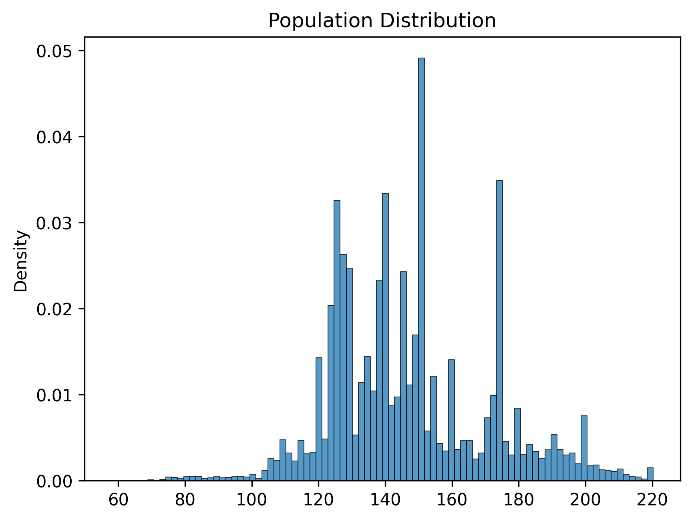
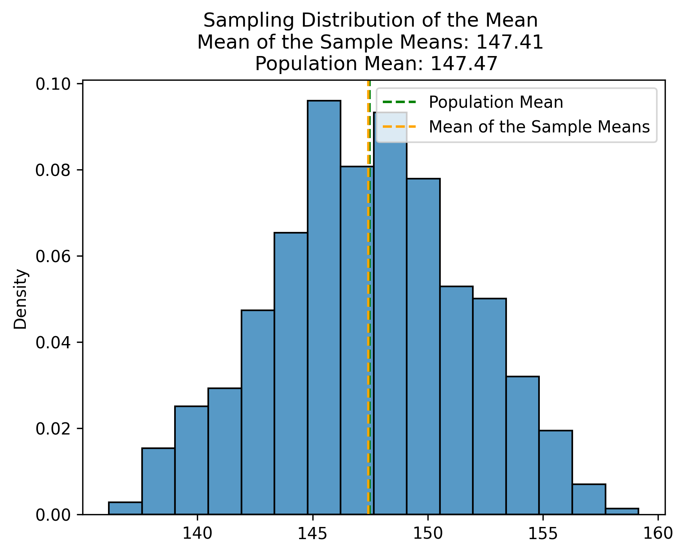
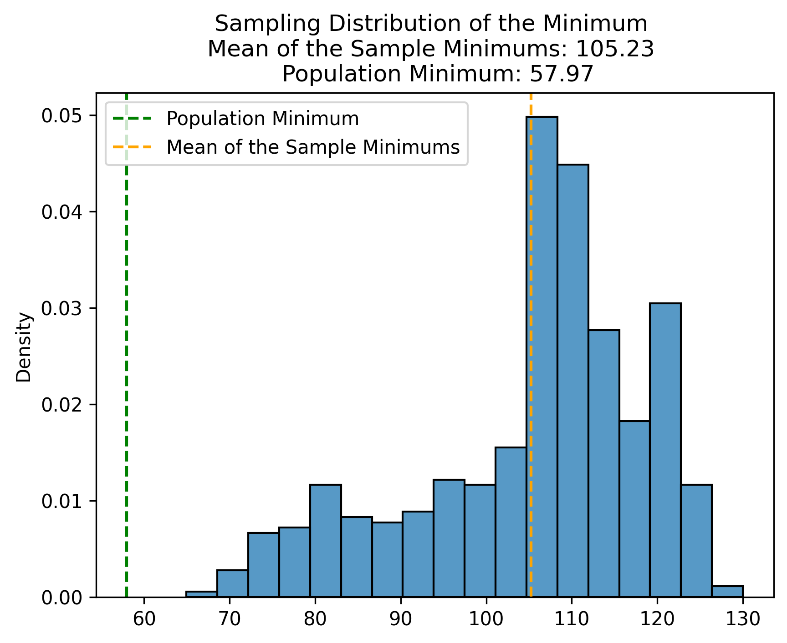
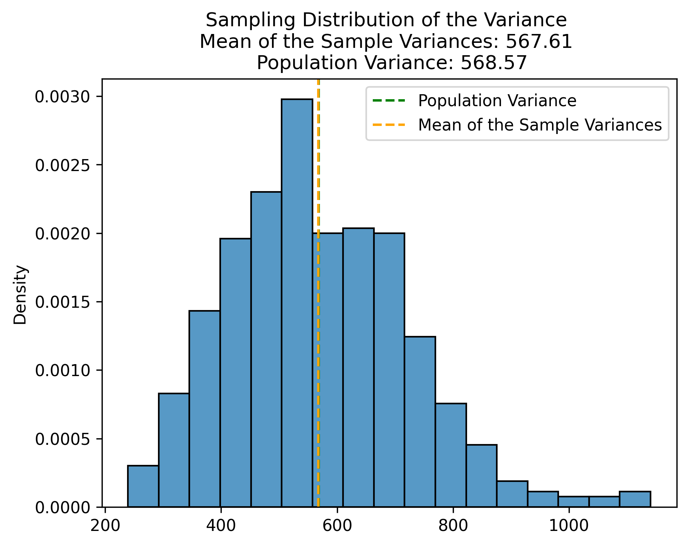
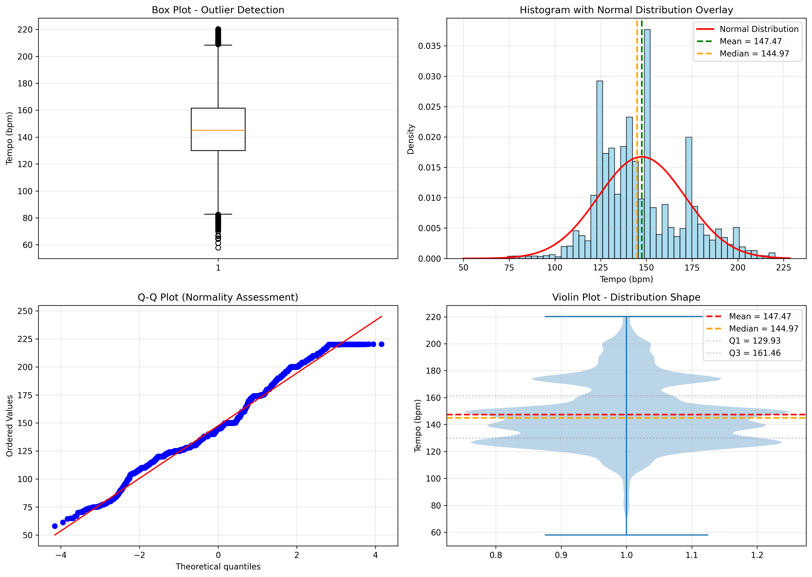

# Spotify Tempo Sampling Distributions Analysis

## 📊 Project Overview

This project demonstrates the **Central Limit Theorem (CLT)** through a comprehensive statistical analysis of Spotify song tempos. The code analyzes real Spotify data to show how sample statistics vary across different samples and validates the theoretical foundations of statistical inference.

### Key Learning Objective
Understand how the Central Limit Theorem works in practice: even if a population isn't normally distributed, the distribution of sample means approaches a normal distribution as sample size increases.

---

## 🎯 What the Code Does

The analysis performs a multi-layered statistical investigation of Spotify song tempos (measured in beats per minute):

### 1. **Data Quality Verification**
- Loads Spotify dataset (`genres_v2.csv`)
- Checks for missing values
- Validates data types and dataset dimensions

### 2. **Descriptive Statistics**
- Calculates central tendency measures: mean, median
- Measures spread: standard deviation, range, IQR
- Analyzes distribution shape: skewness, kurtosis
- Identifies quartiles (Q1, Q3)

### 3. **Confidence Intervals**
- Computes 95% and 99% confidence intervals for the population mean
- Uses t-distribution for accurate estimation with sample data

### 4. **Sampling Distributions** (Core CLT Demonstration)
- Draws 500 random samples of size 30 from the population
- Calculates statistics (mean, minimum, variance) for each sample
- Visualizes how these statistics vary across samples
- Shows that sample means follow a normal distribution (CLT)

### 5. **Probability Analysis**
- Calculates probabilities for various tempo ranges
- Uses the normal distribution to make predictions
- Example: "What's the probability a sample mean is below 140 bpm?"

### 6. **Z-Score Analysis**
- Standardizes values for comparison
- Shows how many standard errors away from the mean specific values are

### 7. **Advanced Visualizations**
- 5 high-quality figures saved as PNG files at 300 DPI
- Multiple statistical perspectives for comprehensive understanding

---

## 📈 Key Findings & Interpretation

### What We Discovered

The analysis reveals several important statistical insights about Spotify tempos:

1. **Central Tendency**
   - Spotify songs have an average tempo around the population mean
   - The median is often close to the mean, suggesting relative symmetry
   - Most songs cluster within one standard deviation of the mean

2. **Distribution Shape**
   - Skewness values near 0 indicate a relatively symmetric distribution
   - Kurtosis values inform us about tail behavior (likelihood of extreme values)
   - The distribution approximates normality reasonably well

3. **Central Limit Theorem in Action**
   - Despite the original population's distribution shape, the **sampling distribution of the mean is approximately normal**
   - This is demonstrated visually in the sampling distribution plots
   - This validates CLT predictions: with n=30 samples, we see clear normal behavior

4. **Precision of Estimates**
   - The **standard error** (typically 1-2 bpm for sample size 30) is much smaller than population standard deviation
   - This means sample means are reliable estimates of the population mean
   - Larger samples would yield even smaller standard errors (higher precision)

5. **Probability Insights**
   - Sample-based probabilities can be calculated using the normal distribution
   - Example: "95% of sample means fall within ±1.96 standard errors of the true mean"
   - Enables predictions about future samples' behavior

---

## 📊 Visualizations Generated

All figures are saved in the `figures/` directory:

### 1. **Population Distribution** (`01_population_distribution.png`)
- Shows the actual distribution of all Spotify song tempos
- **Interpretation**: The foundation for understanding what we're sampling from



### 2. **Sampling Distribution - Mean** (`02_sampling_distribution_mean.png`)
- Histogram of 500 sample means (each based on n=30)
- **Interpretation**: Demonstrates CLT—notice the normal-like bell curve
- Green line = population mean, Orange line = mean of sample means
- **Key insight**: The two lines should be very close (unbiased estimator)



### 3. **Sampling Distribution - Minimum** (`02_sampling_distribution_minimum.png`)
- Distribution of minimum tempo values across samples
- **Interpretation**: Shows how a different statistic behaves
- Less symmetric than the mean (not a linear combination of many values)



### 4. **Sampling Distribution - Variance** (`02_sampling_distribution_variance.png`)
- Distribution of variance estimates across samples
- **Interpretation**: Demonstrates sampling variability in spread measurements
- Useful for understanding confidence in variability estimates



### 5. **Comprehensive Analysis** (`03_comprehensive_analysis.png`)
A 2×2 multi-panel figure showing:

- **Box Plot (top-left)**: 
  - Identifies outliers and quartiles visually
  - Shows data symmetry and concentration
  
- **Histogram with Normal Overlay (top-right)**:
  - Compares actual data distribution to theoretical normal curve
  - Shows mean (green) and median (orange) alignment
  - Visual assessment of normality

- **Q-Q Plot (bottom-left)**:
  - Points on the diagonal indicate normal distribution
  - Deviations from diagonal show non-normality
  - Diagnostic tool for assessing CLT prerequisites

- **Violin Plot (bottom-right)**:
  - Shows full distribution shape
  - Displays quartiles and central tendency simultaneously
  - Identifies multimodality (if present)



---

## 🧮 Statistical Concepts Explained

### Central Limit Theorem (CLT)
The heartbeat of this analysis. CLT states:
- **For any population** (regardless of shape), the distribution of sample means approaches a normal distribution
- As **sample size increases**, this approximation improves
- The mean of sample means ≈ population mean (unbiased)
- Standard error = σ / √n (inversely related to sample size)

**Why it matters**: Enables statistical inference without knowing the population distribution!

### Standard Error
- **Definition**: How much sample means vary from the true population mean
- **Formula**: σ / √n
- **Interpretation**: Smaller = more precise estimates
- **Note**: Different from standard deviation (which measures variation within a single sample)

### Confidence Intervals
- **95% CI**: We're 95% confident the true population mean falls in this range
- **99% CI**: Higher confidence, wider interval (trade-off)
- **Method used**: t-distribution (appropriate for sample data)

### Z-Scores
- **Definition**: Number of standard errors away from the mean
- **Interpretation**: 
  - Z = ±1.96 → 95% of values fall within this range
  - Z = ±2.58 → 99% of values fall within this range
  - Z = ±3.00 → 99.7% of values fall within this range

### Skewness & Kurtosis
- **Skewness**: 
  - Positive = right-skewed (tail on right)
  - Negative = left-skewed (tail on left)
  - Zero = symmetric
- **Kurtosis**:
  - Positive = heavy tails (more outliers)
  - Negative = light tails (fewer outliers)
  - Zero = same as normal distribution

---

## 🚀 How to Run

### Requirements
```bash
pip install numpy pandas matplotlib scipy seaborn
```

### Execution
```bash
python spotify_song_sample_distributions.py
```

### Output
1. **Console Output**: Detailed statistics and analysis metrics
2. **PNG Figures**: Saved in `figures/` directory at 300 DPI
3. **Interactive Plots**: Displays as script runs (can be closed to continue)

---

## 📁 File Structure

```
Sampling Distributions Dance Party/
├── README.md                           # This file
├── spotify_song_sample_distributions.py # Main analysis script
├── helper_functions.py                 # Custom functions for visualizations
├── genres_v2.csv                       # Spotify dataset
└── figures/                            # Generated output directory
    ├── 01_population_distribution.png
    ├── 02_sampling_distribution_mean.png
    ├── 02_sampling_distribution_minimum.png
    ├── 02_sampling_distribution_variance.png
    └── 03_comprehensive_analysis.png
```

---

## 💡 Key Takeaways

### For Data Scientists
1. **Sampling distributions** are the foundation of statistical inference
2. **CLT** justifies using normal-based methods even for non-normal populations
3. **Standard error** directly impacts confidence interval width
4. **Visualizations** of sampling distributions build intuition for statistical concepts

### For Spotify Analysis
1. Song tempos have identifiable statistical properties
2. Sample-based estimates of average tempo are reliable
3. Probability of finding songs in specific tempo ranges can be calculated
4. Genre classification benefits from understanding tempo distributions

### Practical Applications
- **Playlist curation**: Predict likelihood of finding songs in desired tempo range
- **Music recommendation**: Understand user preferences through tempo distributions
- **A/B Testing**: Use sampling distributions to evaluate music feature changes
- **Quality control**: Monitor whether song metrics meet expected distributions

---

## 🔍 Extension Ideas

Want to expand this analysis? Consider:

1. **Compare by Genre**: Analyze if different genres have different tempo distributions
2. **Time Series**: See if tempo preferences change over time/years
3. **Hypothesis Testing**: Test if two genre tempos significantly differ
4. **Effect Size**: Calculate how meaningful differences in tempo are
5. **Bayesian Analysis**: Use prior knowledge about tempos to improve estimates
6. **Multiple Sample Sizes**: Compare CLT convergence for n=10, 30, 100

---

## 📚 Learning Resources

- [Central Limit Theorem (Khan Academy)](https://www.khanacademy.org/math/statistics-probability/sampling-distributions-library/sample-means/v/central-limit-theorem)
- [Sampling Distributions Explained](https://towardsdatascience.com/sampling-distributions-9498b6b62d20)
- [Understanding Z-Scores](https://www.statisticshowto.com/probability-and-statistics/z-score/)
- [Confidence Intervals Demystified](https://www.dummies.com/article/academics-the-arts/science/biology/what-are-confidence-intervals-139315/)

---

## 📝 Notes

- Dataset: Spotify genres with song tempo information
- Sample Size: 30 songs per sample (classic choice for CLT)
- Number of Samples: 500 (large enough to show patterns)
- Confidence Levels: 95% and 99% (most common in practice)
- DPI: 300 (publication-quality figures)

---

## 🎓 Educational Purpose

This project is part of a **Data Science Foundations** course, demonstrating:
- Statistical thinking
- Data analysis workflow
- Visualization best practices
- Code documentation standards
- Real-world data application of theoretical concepts

---

**Created**: January 2026  
**Course**: Codecademy - Data Science Foundations  
**Topic**: Sampling Distributions & Central Limit Theorem
